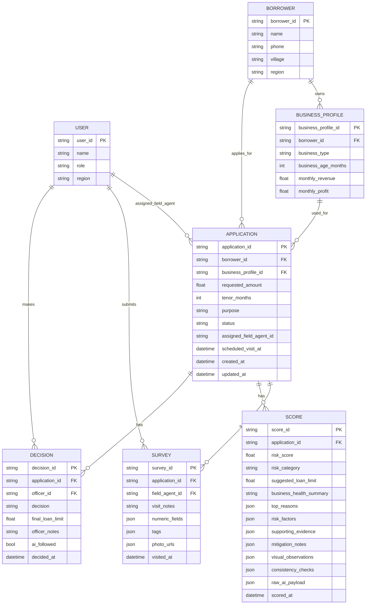

# Vibe Code – ERD (MVP, English Version)

This diagram shows the main entities in the Vibe Code / Artha Vista MVP:

- User (Field Agent, Officer, Admin)
- Borrower & Business Profile
- Application (loan request)
- Survey (onsite visit result)
- Score (AI scoring & analysis)
- Decision (Officer decision)

## Notes on the SCORE Entity (AI Insight Pack)

The `SCORE` entity does not only store a numeric risk score; it also contains a full AI-generated insight pack produced by Gemini, including:

- `risk_score` and `risk_category` (Low / Medium / High).
- `suggested_loan_limit` – recommended loan amount for the borrower.
- `business_health_summary` – a narrative summary of business health (revenue stability, customer diversity, etc.).
- `top_reasons` – key positive and negative drivers that explain the score.
- `risk_factors` – structured list of risk factors (code, label, direction of impact).
- `supporting_evidence` – snippets from visit notes and descriptions of photos used by the AI as evidence.
- `mitigation_notes` – suggested follow-up or risk mitigation steps for the Officer.
- `visual_observations` – insights extracted from photos (store/house condition, inventory organization, etc.).
- `consistency_checks` – checks between numeric data and onsite observations (e.g., revenue vs. inventory, claims vs. visual proof).

Because of this, the `SCORE` table acts as the center of **explainable AI scoring**, instead of just being a place to store a single 0–100 number.
