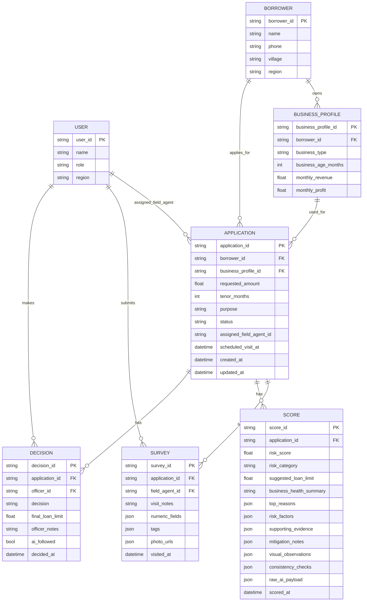

# Vibe Code – ERD (MVP, English)

This ERD describes the main entities for the Vibe Code / Artha Vista MVP.

- `USER` – Field Agent, Officer, Admin
- `BORROWER` and `BUSINESS_PROFILE`
- `APPLICATION` – loan request
- `SURVEY` – onsite visit result
- `SCORE` – AI scoring & insight pack
- `DECISION` – Officer decision

## SCORE Entity as AI Insight Pack

The `SCORE` entity is designed to store a complete AI Insight Pack, not just a number:

- **Core metrics**
  - `risk_score` – normalized score 0–100.
  - `risk_category` – `low`, `medium`, or `high`.
  - `suggested_loan_limit` – recommended loan amount.

- **Narrative summary**
  - `business_health_summary` – paragraph describing revenue stability, inventory, customer base, etc.
  - `top_reasons` – bullet-point reasons that explain the score (mix of positive & negative drivers).

- **Structured factors & evidence**
  - `risk_factors` – encoded factors with `code`, `label`, `impact`, and `weight`.
  - `supporting_evidence` – snippets from field notes and photo descriptions used by the AI.

- **Mitigation & observations**
  - `mitigation_notes` – concrete suggestions for Officers (e.g., start with lower limit, monitor first cycles).
  - `visual_observations` – structured observations derived from photos (store condition, equipment, etc.).

- **Consistency checks**
  - `consistency_checks` – comparison between numeric data (revenue, inventory, etc.) and onsite observations.

This makes `SCORE` the central place for **explainable AI scoring**, usable in Officer dashboards, audits, and potential retraining in the future.
