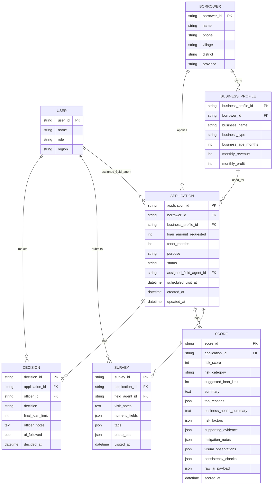

# Vibe Code – ERD (MVP)

Diagram ini menggambarkan relasi utama antara entity dalam sistem Vibe Code untuk MVP:
- User (Field Agent, Officer, Admin)
- Borrower & Business Profile
- Application (pengajuan)
- Survey (hasil kunjungan lapangan)
- Score (hasil AI scoring & analysis)
- Decision (keputusan officer)

## Catatan Entity SCORE (AI Insight Pack)

Entity `SCORE` tidak hanya menyimpan angka skor risiko, tetapi juga paket insight lengkap yang dihasilkan oleh Gemini, antara lain:

- `risk_score` dan `risk_category` (Low / Medium / High).
- `suggested_loan_limit` yang direkomendasikan untuk borrower.
- `business_health_summary` yang merangkum kesehatan usaha (stabilitas omzet, keragaman pelanggan, dsb).
- `risk_factors` terstruktur (kode faktor, label, arah pengaruh).
- `supporting_evidence` dari catatan kunjungan & foto lapangan.
- `mitigation_notes` berisi saran tindak lanjut bagi Officer.
- `visual_observations` hasil analisis foto (kondisi warung/rumah, kerapihan stok, dll).
- `consistency_checks` untuk melihat konsistensi antara data numerik dan observasi lapangan.

Dengan begitu, tabel `SCORE` berperan sebagai pusat **explainable AI scoring**, bukan sekadar menyimpan angka 0–100.
